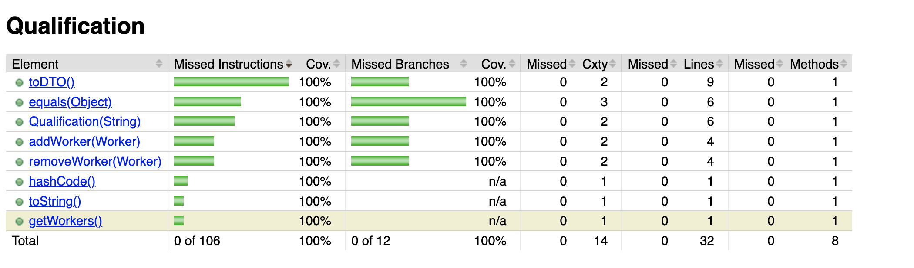
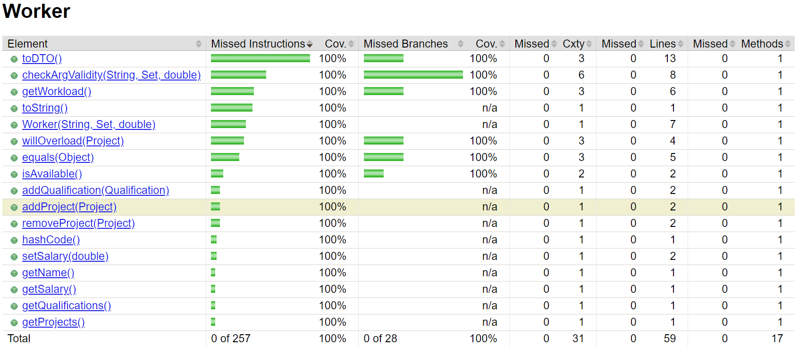
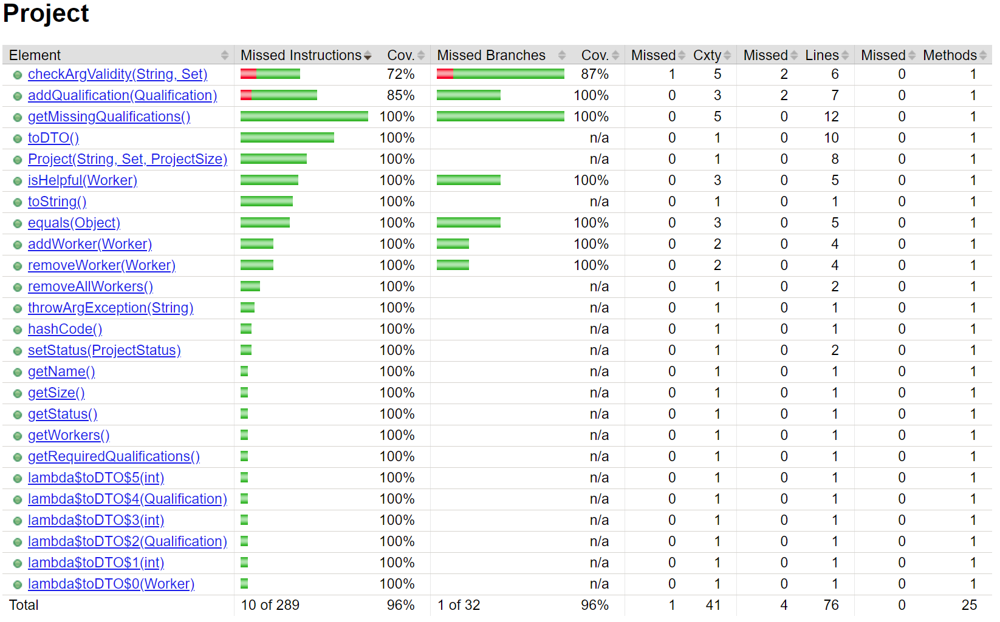

## Reflection
Overall we did very good on code coverage. We were able to achieve 100% coverage, both branch and line, for all of the methods we implemented. The caveat being that Jacoco has a [known limitation](https://www.eclemma.org/jacoco/trunk/doc/faq.html) when it comes to reporting coverage of methods which throw exceptions. This limitation can be seen in our coverage report for the Project class. Beyond this benchmark, there are even more tests from all the fields in the isp tables. If we can keep this up moving forward or even improve, we'll be in good shape.

## Qualification 

## Worker 

## Project 

