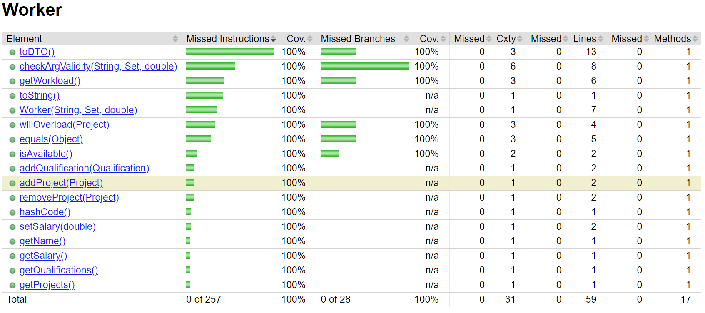
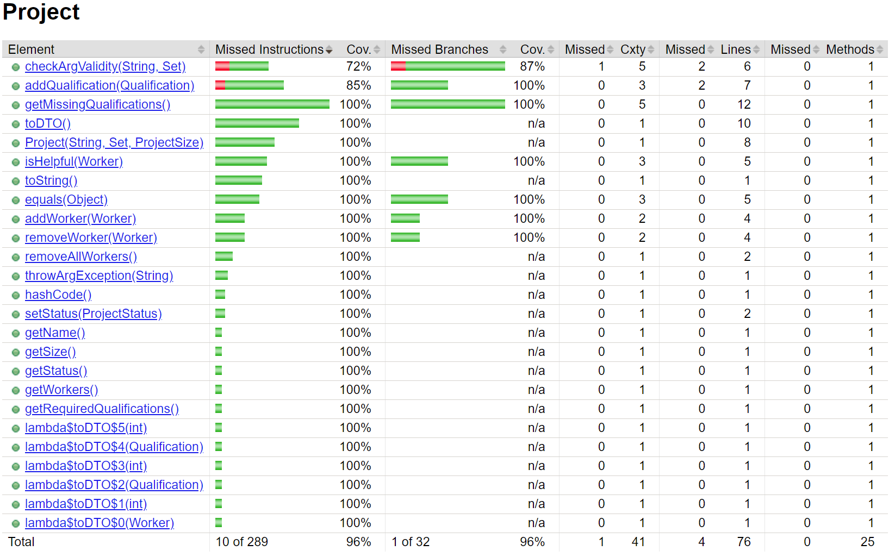

## Reflection
Again we achieved 100% coverage which with how large of a class company is is very impressive. The only thing we could improve on is getting 100% branch coverage on a method the first time that method is merged. However, somethimes thats difficult as methods can rely on other methods which havent been created yet.

Note:
Jacoco has a [known limitation](https://www.eclemma.org/jacoco/trunk/doc/faq.html) when it comes to reporting coverage of methods which throw exceptions. This limitation can be seen in our coverage report for the Project class.

## Company 

## Qualification 

## Worker 

## Project 

