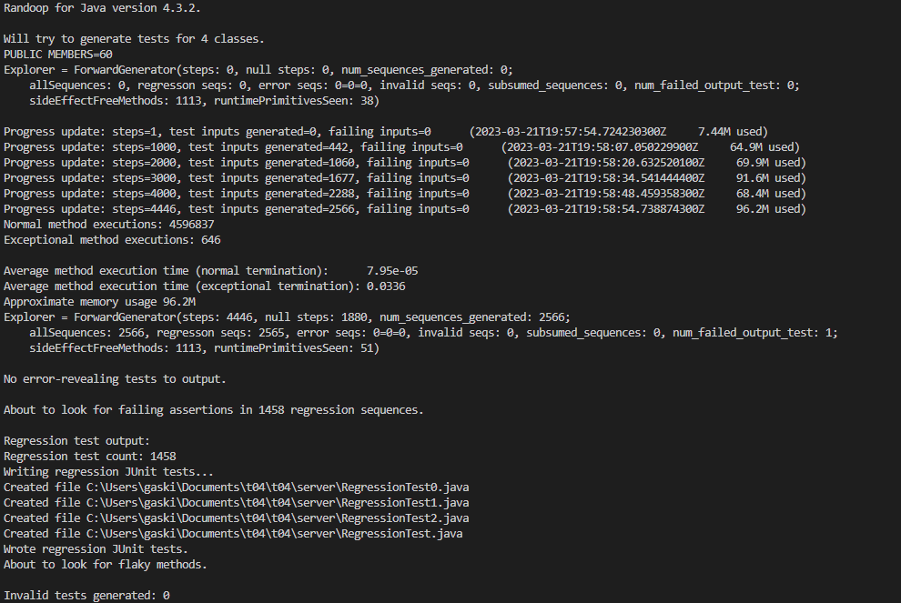
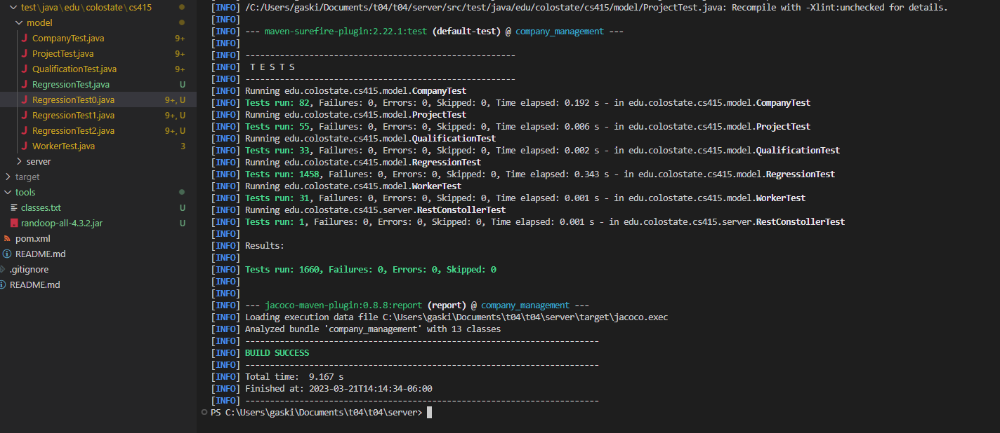

## Randoop Logs

## Randoop Tests ran

## Evosuite Logs

  
Generate Tests Output

% java -jar tools/evosuite-1.0.6.jar -prefix edu.colostate.cs415.model -projectCP target/classes
* EvoSuite 1.0.6
* Analyzing classpath (generating inheritance tree)
    - target/classes
* Found 6 matching classes for prefix edu.colostate.cs415.model
* Current class: edu.colostate.cs415.model.Worker
* Going to generate test cases for class: edu.colostate.cs415.model.Worker
* Starting client
* Connecting to master process on port 17623
* Analyzing classpath:
* Inheritance tree loaded from /var/folders/7r/023924y57_7_fwpyr0lgvqww0000gn/T/ES_inheritancetree1324056619468068804.xml.gz
* Finished analyzing classpath
* Generating tests for class edu.colostate.cs415.model.Worker
* Test criteria:
    - Line Coverage
    - Branch Coverage
    - Exception
    - Mutation testing (weak)
    - Method-Output Coverage
    - Top-Level Method Coverage
    - No-Exception Top-Level Method Coverage
    - Context Branch Coverage
* Setting up search algorithm for whole suite generation
* Total number of test goals:
    - Line 67
    - Branch 47
    - Exception 0
    - MutationFactory 110
    - Output 37
    - Method 16
    - MethodNoException 16
    - CBranchFitnessFactory 47
* Using seed 1679970487527
* Starting evolution
  [Progress:>                             1%] [Cov:=================>                 51%][MASTER] 20:28:10.388 [logback-2] ERROR ClientNodeImpl - Cannot inform master of change of state
  java.rmi.ServerException: RemoteException occurred in server thread; nested exception is:
  java.rmi.UnmarshalException: error unmarshalling arguments; nested exception is:
  java.io.OptionalDataException
  at sun.rmi.server.UnicastServerRef.dispatch(UnicastServerRef.java:389) ~[na:1.8.0_362]
  at sun.rmi.transport.Transport$1.run(Transport.java:200) ~[na:1.8.0_362]
  at sun.rmi.transport.Transport$1.run(Transport.java:197) ~[na:1.8.0_362]
  at java.security.AccessController.doPrivileged(Native Method) ~[na:1.8.0_362]
  at sun.rmi.transport.Transport.serviceCall(Transport.java:196) ~[na:1.8.0_362]
  at sun.rmi.transport.tcp.TCPTransport.handleMessages(TCPTransport.java:573) ~[na:1.8.0_362]
  at sun.rmi.transport.tcp.TCPTransport$ConnectionHandler.run0(TCPTransport.java:834) ~[na:1.8.0_362]
  at sun.rmi.transport.tcp.TCPTransport$ConnectionHandler.lambda$run$0(TCPTransport.java:688) ~[na:1.8.0_362]
  at java.security.AccessController.doPrivileged(Native Method) ~[na:1.8.0_362]
  at sun.rmi.transport.tcp.TCPTransport$ConnectionHandler.run(TCPTransport.java:687) ~[na:1.8.0_362]
  at java.util.concurrent.ThreadPoolExecutor.runWorker(ThreadPoolExecutor.java:1149) ~[na:1.8.0_362]
  at java.util.concurrent.ThreadPoolExecutor$Worker.run(ThreadPoolExecutor.java:624) ~[na:1.8.0_362]
  at java.lang.Thread.run(Thread.java:750) ~[na:1.8.0_362]
  at sun.rmi.transport.StreamRemoteCall.exceptionReceivedFromServer(StreamRemoteCall.java:303) ~[na:1.8.0_362]
  at sun.rmi.transport.StreamRemoteCall.executeCall(StreamRemoteCall.java:279) ~[na:1.8.0_362]
  at sun.rmi.server.UnicastRef.invoke(UnicastRef.java:164) ~[na:1.8.0_362]
  at java.rmi.server.RemoteObjectInvocationHandler.invokeRemoteMethod(RemoteObjectInvocationHandler.java:235) ~[na:1.8.0_362]
  at java.rmi.server.RemoteObjectInvocationHandler.invoke(RemoteObjectInvocationHandler.java:180) ~[na:1.8.0_362]
  at com.sun.proxy.$Proxy7.evosuite_collectStatistics(Unknown Source) ~[na:na]
  at org.evosuite.rmi.service.ClientNodeImpl.updateStatistics(ClientNodeImpl.java:237) ~[evosuite-1.0.6.jar:1.0.6]
  at org.evosuite.statistics.StatisticsSender.sendIndividualToMaster(StatisticsSender.java:68) [evosuite-1.0.6.jar:1.0.6]
  at org.evosuite.statistics.StatisticsListener$1.run(StatisticsListener.java:71) [evosuite-1.0.6.jar:1.0.6]
  Caused by: java.rmi.UnmarshalException: error unmarshalling arguments; nested exception is:
  java.io.OptionalDataException
  at sun.rmi.server.UnicastServerRef.dispatch(UnicastServerRef.java:348) ~[na:1.8.0_362]
  at sun.rmi.transport.Transport$1.run(Transport.java:200) ~[na:1.8.0_362]
  at sun.rmi.transport.Transport$1.run(Transport.java:197) ~[na:1.8.0_362]
  at java.security.AccessController.doPrivileged(Native Method) ~[na:1.8.0_362]
  at sun.rmi.transport.Transport.serviceCall(Transport.java:196) ~[na:1.8.0_362]
  at sun.rmi.transport.tcp.TCPTransport.handleMessages(TCPTransport.java:573) ~[na:1.8.0_362]
  at sun.rmi.transport.tcp.TCPTransport$ConnectionHandler.run0(TCPTransport.java:834) ~[na:1.8.0_362]
  at sun.rmi.transport.tcp.TCPTransport$ConnectionHandler.lambda$run$0(TCPTransport.java:688) ~[na:1.8.0_362]
  at java.security.AccessController.doPrivileged(Native Method) ~[na:1.8.0_362]
  at sun.rmi.transport.tcp.TCPTransport$ConnectionHandler.run(TCPTransport.java:687) ~[na:1.8.0_362]
  at java.util.concurrent.ThreadPoolExecutor.runWorker(ThreadPoolExecutor.java:1149) ~[na:1.8.0_362]
  at java.util.concurrent.ThreadPoolExecutor$Worker.run(ThreadPoolExecutor.java:624) ~[na:1.8.0_362]
  at java.lang.Thread.run(Thread.java:750) ~[na:1.8.0_362]
  Caused by: java.io.OptionalDataException: null
  at java.io.ObjectInputStream.readObject0(ObjectInputStream.java:1692) ~[na:1.8.0_362]
  at java.io.ObjectInputStream.readObject(ObjectInputStream.java:503) ~[na:1.8.0_362]
  at java.io.ObjectInputStream.readObject(ObjectInputStream.java:461) ~[na:1.8.0_362]
  at java.util.HashMap.readObject(HashMap.java:1416) ~[na:1.8.0_362]
  at sun.reflect.GeneratedMethodAccessor8.invoke(Unknown Source) ~[na:na]
  at sun.reflect.DelegatingMethodAccessorImpl.invoke(DelegatingMethodAccessorImpl.java:43) ~[na:1.8.0_362]
  at java.lang.reflect.Method.invoke(Method.java:498) ~[na:1.8.0_362]
  at java.io.ObjectStreamClass.invokeReadObject(ObjectStreamClass.java:1184) ~[na:1.8.0_362]
  at java.io.ObjectInputStream.readSerialData(ObjectInputStream.java:2322) ~[na:1.8.0_362]
  at java.io.ObjectInputStream.readOrdinaryObject(ObjectInputStream.java:2213) ~[na:1.8.0_362]
  at java.io.ObjectInputStream.readObject0(ObjectInputStream.java:1669) ~[na:1.8.0_362]
  at java.io.ObjectInputStream.defaultReadFields(ObjectInputStream.java:2431) ~[na:1.8.0_362]
  at java.io.ObjectInputStream.readSerialData(ObjectInputStream.java:2355) ~[na:1.8.0_362]
  at java.io.ObjectInputStream.readOrdinaryObject(ObjectInputStream.java:2213) ~[na:1.8.0_362]
  at java.io.ObjectInputStream.readObject0(ObjectInputStream.java:1669) ~[na:1.8.0_362]
  at java.io.ObjectInputStream.readObject(ObjectInputStream.java:503) ~[na:1.8.0_362]
  at java.io.ObjectInputStream.readObject(ObjectInputStream.java:461) ~[na:1.8.0_362]
  at java.util.HashMap.readObject(HashMap.java:1416) ~[na:1.8.0_362]
  at sun.reflect.GeneratedMethodAccessor8.invoke(Unknown Source) ~[na:na]
  at sun.reflect.DelegatingMethodAccessorImpl.invoke(DelegatingMethodAccessorImpl.java:43) ~[na:1.8.0_362]
  at java.lang.reflect.Method.invoke(Method.java:498) ~[na:1.8.0_362]
  at java.io.ObjectStreamClass.invokeReadObject(ObjectStreamClass.java:1184) ~[na:1.8.0_362]
  at java.io.ObjectInputStream.readSerialData(ObjectInputStream.java:2322) ~[na:1.8.0_362]
  at java.io.ObjectInputStream.readOrdinaryObject(ObjectInputStream.java:2213) ~[na:1.8.0_362]
  at java.io.ObjectInputStream.readObject0(ObjectInputStream.java:1669) ~[na:1.8.0_362]
  at java.io.ObjectInputStream.defaultReadFields(ObjectInputStream.java:2431) ~[na:1.8.0_362]
  at java.io.ObjectInputStream.readSerialData(ObjectInputStream.java:2355) ~[na:1.8.0_362]
  [Progress:>                             1%] [Cov:============================>      80%]eam.java:2213) ~[na:1.8.0_362]
  at java.io.ObjectInputStream.readObject0(ObjectInputStream.java:1669) ~[na:1.8.0_362]
  at java.io.ObjectInputStream.readObject(ObjectInputStream.java:503) ~[na:1.8.0_362]
  at java.io.ObjectInputStream.readObject(ObjectInputStream.java:461) ~[na:1.8.0_362]
  at sun.rmi.server.UnicastRef.unmarshalValue(UnicastRef.java:327) ~[na:1.8.0_362]
  at sun.rmi.server.UnicastServerRef.unmarshalParametersUnchecked(UnicastServerRef.java:629) ~[na:1.8.0_362]
  at sun.rmi.server.UnicastServerRef.unmarshalParameters(UnicastServerRef.java:617) ~[na:1.8.0_362]
  at sun.rmi.server.UnicastServerRef.dispatch(UnicastServerRef.java:338) ~[na:1.8.0_362]
  ... 12 common frames omitted
  [Progress:====================>         68%] [Cov:================================>  93%][MASTER] 20:28:50.384 [logback-2] ERROR TestCluster - Failed to check cache for java.util.function.Predicate<T> : Type points to itself
  [Progress:==============================100%] [Cov:================================>  93%]
* Search finished after 61s and 637 generations, 191720 statements, best individual has fitness: 30.424999999999997
* Minimizing test suite
* Going to analyze the coverage criteria
* Coverage analysis for criterion LINE
* Coverage of criterion LINE: 100%
* Total number of goals: 67
* Number of covered goals: 67
* Coverage analysis for criterion BRANCH
* Coverage of criterion BRANCH: 96%
* Total number of goals: 47
* Number of covered goals: 45
* Coverage analysis for criterion EXCEPTION
* Coverage of criterion EXCEPTION: 100%
* Total number of goals: 7
* Number of covered goals: 7
* Coverage analysis for criterion WEAKMUTATION
* Coverage of criterion WEAKMUTATION: 93%
* Total number of goals: 110
* Number of covered goals: 102
* Coverage analysis for criterion OUTPUT
* Coverage of criterion OUTPUT: 59%
* Total number of goals: 37
* Number of covered goals: 22
* Coverage analysis for criterion METHOD
* Coverage of criterion METHOD: 100%
* Total number of goals: 16
* Number of covered goals: 16
* Coverage analysis for criterion METHODNOEXCEPTION
* Coverage of criterion METHODNOEXCEPTION: 100%
* Total number of goals: 16
* Number of covered goals: 16
* Coverage analysis for criterion CBRANCH
* Coverage of criterion CBRANCH: 96%
* Total number of goals: 47
* Number of covered goals: 45
* Generated 35 tests with total length 190
* Resulting test suite's coverage: 93% (average coverage for all fitness functions)
* Generating assertions
* Resulting test suite's mutation score: 58%
* Compiling and checking tests
* Writing JUnit test case 'Worker_ESTest' to evosuite-tests
* Done!

* Computation finished
* Current class: edu.colostate.cs415.model.Project
* Going to generate test cases for class: edu.colostate.cs415.model.Project
* Starting client
* Connecting to master process on port 7477
* Analyzing classpath:
* Inheritance tree loaded from /var/folders/7r/023924y57_7_fwpyr0lgvqww0000gn/T/ES_inheritancetree1324056619468068804.xml.gz
* Finished analyzing classpath
* Generating tests for class edu.colostate.cs415.model.Project
* Test criteria:
    - Line Coverage
    - Branch Coverage
    - Exception
    - Mutation testing (weak)
    - Method-Output Coverage
    - Top-Level Method Coverage
    - No-Exception Top-Level Method Coverage
    - Context Branch Coverage
* Setting up search algorithm for whole suite generation
* Total number of test goals:
    - Line 78
    - Branch 59
    - Exception 0
    - MutationFactory 60
    - Output 36
    - Method 17
    - MethodNoException 17
    - CBranchFitnessFactory 59
* Using seed 1679970557495
* Starting evolution
  [Progress:===============>              50%] [Cov:================================>  92%][MASTER] 20:29:49.663 [logback-2] ERROR TestCluster - Failed to check cache for java.util.function.Predicate<T> : Type points to itself
  [Progress:==============================100%] [Cov:================================>  92%]
* Search finished after 61s and 617 generations, 191258 statements, best individual has fitness: 24.976190476190478
* Minimizing test suite
* Going to analyze the coverage criteria
* Coverage analysis for criterion LINE
* Coverage of criterion LINE: 99%
* Total number of goals: 78
* Number of covered goals: 77
* Coverage analysis for criterion BRANCH
* Coverage of criterion BRANCH: 97%
* Total number of goals: 59
* Number of covered goals: 57
* Coverage analysis for criterion EXCEPTION
* Coverage of criterion EXCEPTION: 100%
* Total number of goals: 6
* Number of covered goals: 6
* Coverage analysis for criterion WEAKMUTATION
* Coverage of criterion WEAKMUTATION: 90%
* Total number of goals: 60
* Number of covered goals: 54
* Coverage analysis for criterion OUTPUT
* Coverage of criterion OUTPUT: 58%
* Total number of goals: 36
* Number of covered goals: 21
* Coverage analysis for criterion METHOD
* Coverage of criterion METHOD: 100%
* Total number of goals: 17
* Number of covered goals: 17
* Coverage analysis for criterion METHODNOEXCEPTION
* Coverage of criterion METHODNOEXCEPTION: 100%
* Total number of goals: 17
* Number of covered goals: 17
* Coverage analysis for criterion CBRANCH
* Coverage of criterion CBRANCH: 97%
* Total number of goals: 59
* Number of covered goals: 57
* Generated 33 tests with total length 196
* Resulting test suite's coverage: 93% (average coverage for all fitness functions)
* Generating assertions
* Resulting test suite's mutation score: 73%
* Compiling and checking tests
* Writing JUnit test case 'Project_ESTest' to evosuite-tests
* Done!

* Computation finished
* Current class: edu.colostate.cs415.model.Qualification
* Going to generate test cases for class: edu.colostate.cs415.model.Qualification
* Starting client
* Connecting to master process on port 13104
* Analyzing classpath:
* Inheritance tree loaded from /var/folders/7r/023924y57_7_fwpyr0lgvqww0000gn/T/ES_inheritancetree1324056619468068804.xml.gz
* Finished analyzing classpath
* Generating tests for class edu.colostate.cs415.model.Qualification
* Test criteria:
    - Line Coverage
    - Branch Coverage
    - Exception
    - Mutation testing (weak)
    - Method-Output Coverage
    - Top-Level Method Coverage
    - No-Exception Top-Level Method Coverage
    - Context Branch Coverage
* Setting up search algorithm for whole suite generation
* Total number of test goals:
    - Line 29
    - Branch 19
    - Exception 0
    - MutationFactory 12
    - Output 13
    - Method 8
    - MethodNoException 8
    - CBranchFitnessFactory 19
* Using seed 1679970627049
* Starting evolution
  [Progress:=>                            6%] [Cov:================================>  93%][MASTER] 20:30:32.632 [logback-2] ERROR TestCluster - Failed to check cache for java.util.function.Predicate<T> : Type points to itself
  [Progress:==============================100%] [Cov:=================================> 95%]
* Search finished after 61s and 1361 generations, 215205 statements, best individual has fitness: 5.25
* Minimizing test suite
* Going to analyze the coverage criteria
* Coverage analysis for criterion LINE
* Coverage of criterion LINE: 100%
* Total number of goals: 29
* Number of covered goals: 29
* Coverage analysis for criterion BRANCH
* Coverage of criterion BRANCH: 100%
* Total number of goals: 19
* Number of covered goals: 19
* Coverage analysis for criterion EXCEPTION
* Coverage of criterion EXCEPTION: 100%
* Total number of goals: 3
* Number of covered goals: 3
* Coverage analysis for criterion WEAKMUTATION
* Coverage of criterion WEAKMUTATION: 100%
* Total number of goals: 12
* Number of covered goals: 12
* Coverage analysis for criterion OUTPUT
* Coverage of criterion OUTPUT: 62%
* Total number of goals: 13
* Number of covered goals: 8
* Coverage analysis for criterion METHOD
* Coverage of criterion METHOD: 100%
* Total number of goals: 8
* Number of covered goals: 8
* Coverage analysis for criterion METHODNOEXCEPTION
* Coverage of criterion METHODNOEXCEPTION: 100%
* Total number of goals: 8
* Number of covered goals: 8
* Coverage analysis for criterion CBRANCH
* Coverage of criterion CBRANCH: 100%
* Total number of goals: 19
* Number of covered goals: 19
* Generated 14 tests with total length 33
* Resulting test suite's coverage: 95% (average coverage for all fitness functions)
* Generating assertions
* Resulting test suite's mutation score: 62%
* Compiling and checking tests
* Writing JUnit test case 'Qualification_ESTest' to evosuite-tests
* Done!

* Computation finished
* Current class: edu.colostate.cs415.model.ProjectStatus
* Going to generate test cases for class: edu.colostate.cs415.model.ProjectStatus
* Starting client
* Connecting to master process on port 11265
* Analyzing classpath:
* Inheritance tree loaded from /var/folders/7r/023924y57_7_fwpyr0lgvqww0000gn/T/ES_inheritancetree1324056619468068804.xml.gz
* Finished analyzing classpath
* Generating tests for class edu.colostate.cs415.model.ProjectStatus
* Test criteria:
    - Line Coverage
    - Branch Coverage
    - Exception
    - Mutation testing (weak)
    - Method-Output Coverage
    - Top-Level Method Coverage
    - No-Exception Top-Level Method Coverage
    - Context Branch Coverage
* Setting up search algorithm for whole suite generation
* Total number of test goals:
    - Line 0
    - Branch 0
    - Exception 0
    - MutationFactory 0
    - Output 0
    - Method 0
    - MethodNoException 0
    - CBranchFitnessFactory 0
* Using seed 1679970693235
* Starting evolution
  [Progress:>                             0%] [Cov:===================================100%]
* Search finished after 0s and 0 generations, 559 statements, best individual has fitness: 1.0
* Minimizing test suite
* Going to analyze the coverage criteria
* Coverage analysis for criterion LINE
* Coverage of criterion LINE: 100% (no goals)
* Coverage analysis for criterion BRANCH
* Coverage of criterion BRANCH: 100% (no goals)
* Coverage analysis for criterion EXCEPTION
* Coverage of criterion EXCEPTION: 100% (no goals)
* Coverage analysis for criterion WEAKMUTATION
* Coverage of criterion WEAKMUTATION: 100% (no goals)
* Coverage analysis for criterion OUTPUT
* Coverage of criterion OUTPUT: 100% (no goals)
* Coverage analysis for criterion METHOD
* Coverage of criterion METHOD: 100% (no goals)
* Coverage analysis for criterion METHODNOEXCEPTION
* Coverage of criterion METHODNOEXCEPTION: 100% (no goals)
* Coverage analysis for criterion CBRANCH
* Coverage of criterion CBRANCH: 100% (no goals)
* Generated 0 tests with total length 0
* Resulting test suite's coverage: 100% (average coverage for all fitness functions)
* Generating assertions
* Resulting test suite's mutation score: 100%
* Compiling and checking tests
* Writing JUnit test case 'ProjectStatus_ESTest' to evosuite-tests
* Done!

* Computation finished
* Current class: edu.colostate.cs415.model.Company
* Going to generate test cases for class: edu.colostate.cs415.model.Company
* Starting client
* Connecting to master process on port 14066
* Analyzing classpath:
* Inheritance tree loaded from /var/folders/7r/023924y57_7_fwpyr0lgvqww0000gn/T/ES_inheritancetree1324056619468068804.xml.gz
* Finished analyzing classpath
* Generating tests for class edu.colostate.cs415.model.Company
* Test criteria:
    - Line Coverage
    - Branch Coverage
    - Exception
    - Mutation testing (weak)
    - Method-Output Coverage
    - Top-Level Method Coverage
    - No-Exception Top-Level Method Coverage
    - Context Branch Coverage
* Setting up search algorithm for whole suite generation
* Total number of test goals:
    - Line 151
    - Branch 138
    - Exception 0
    - MutationFactory 168
    - Output 58
    - Method 20
    - MethodNoException 20
    - CBranchFitnessFactory 138
* Using seed 1679970695632
* Starting evolution
  [Progress:>                             0%] [Cov:>                                  0%][MASTER] 20:31:37.346 [logback-2] ERROR TestCluster - Failed to check cache for java.util.LinkedList<E> : Type points to itself
  [Progress:=====>                        18%] [Cov:=======================>           66%][MASTER] 20:31:48.338 [logback-2] ERROR TestCluster - Failed to check cache for java.util.function.Predicate<T> : Type points to itself
  [Progress:==============================100%] [Cov:===============================>   89%]
* Search finished after 61s and 182 generations, 75213 statements, best individual has fitness: 91.25353535353536
* Minimizing test suite
* Going to analyze the coverage criteria
* Coverage analysis for criterion LINE
* Coverage of criterion LINE: 94%
* Total number of goals: 151
* Number of covered goals: 142
* Coverage analysis for criterion BRANCH
* Coverage of criterion BRANCH: 87%
* Total number of goals: 138
* Number of covered goals: 120
* Coverage analysis for criterion EXCEPTION
* Coverage of criterion EXCEPTION: 100%
* Total number of goals: 8
* Number of covered goals: 8
* Coverage analysis for criterion WEAKMUTATION
* Coverage of criterion WEAKMUTATION: 80%
* Total number of goals: 168
* Number of covered goals: 135
* Coverage analysis for criterion OUTPUT
* Coverage of criterion OUTPUT: 64%
* Total number of goals: 58
* Number of covered goals: 37
* Coverage analysis for criterion METHOD
* Coverage of criterion METHOD: 100%
* Total number of goals: 20
* Number of covered goals: 20
* Coverage analysis for criterion METHODNOEXCEPTION
* Coverage of criterion METHODNOEXCEPTION: 100%
* Total number of goals: 20
* Number of covered goals: 20
* Coverage analysis for criterion CBRANCH
* Coverage of criterion CBRANCH: 87%
* Total number of goals: 138
* Number of covered goals: 120
* Generated 52 tests with total length 255
* Resulting test suite's coverage: 89% (average coverage for all fitness functions)
* Generating assertions
* Resulting test suite's mutation score: 43%
* Compiling and checking tests
* Writing JUnit test case 'Company_ESTest' to evosuite-tests
* Done!

* Computation finished
* Current class: edu.colostate.cs415.model.ProjectSize
* Going to generate test cases for class: edu.colostate.cs415.model.ProjectSize
* Starting client
* Connecting to master process on port 8190
* Analyzing classpath:
* Inheritance tree loaded from /var/folders/7r/023924y57_7_fwpyr0lgvqww0000gn/T/ES_inheritancetree1324056619468068804.xml.gz
* Finished analyzing classpath
* Generating tests for class edu.colostate.cs415.model.ProjectSize
* Test criteria:
    - Line Coverage
    - Branch Coverage
    - Exception
    - Mutation testing (weak)
    - Method-Output Coverage
    - Top-Level Method Coverage
    - No-Exception Top-Level Method Coverage
    - Context Branch Coverage
* Setting up search algorithm for whole suite generation
* Total number of test goals:
    - Line 4
    - Branch 1
    - Exception 0
    - MutationFactory 3
    - Output 10
    - Method 1
    - MethodNoException 1
    - CBranchFitnessFactory 1
* Using seed 1679970771157
* Starting evolution
  [Progress:==============================100%] [Cov:=============================>     83%]
* Search finished after 61s and 3954 generations, 261703 statements, best individual has fitness: 8.75
* Minimizing test suite
* Going to analyze the coverage criteria
* Coverage analysis for criterion LINE
* Coverage of criterion LINE: 25%
* Total number of goals: 4
* Number of covered goals: 1
* Coverage analysis for criterion BRANCH
* Coverage of criterion BRANCH: 100%
* Total number of goals: 1
* Number of covered goals: 1
* Coverage analysis for criterion EXCEPTION
* Coverage of criterion EXCEPTION: 100% (no goals)
* Coverage analysis for criterion WEAKMUTATION
* Coverage of criterion WEAKMUTATION: 100%
* Total number of goals: 3
* Number of covered goals: 3
* Coverage analysis for criterion OUTPUT
* Coverage of criterion OUTPUT: 30%
* Total number of goals: 10
* Number of covered goals: 3
* Coverage analysis for criterion METHOD
* Coverage of criterion METHOD: 100%
* Total number of goals: 1
* Number of covered goals: 1
* Coverage analysis for criterion METHODNOEXCEPTION
* Coverage of criterion METHODNOEXCEPTION: 100%
* Total number of goals: 1
* Number of covered goals: 1
* Coverage analysis for criterion CBRANCH
* Coverage of criterion CBRANCH: 100%
* Total number of goals: 1
* Number of covered goals: 1
* Generated 3 tests with total length 4
* Resulting test suite's coverage: 82% (average coverage for all fitness functions)
* Generating assertions
* Resulting test suite's mutation score: 50%
* Compiling and checking tests
* Writing JUnit test case 'ProjectSize_ESTest' to evosuite-tests
* Done!

* Computation finished

  
Run Tests Output

/Users/aldenhaase/Library/Java/JavaVirtualMachines/corretto-1.8.0_362/Contents/Home/bin/java -Dmaven.multiModuleProjectDirectory=/Users/aldenhaase/Documents/415/t04/server -Djansi.passthrough=true -Dmaven.home=/Applications/IntelliJ IDEA.app/Contents/plugins/maven/lib/maven3 -Dclassworlds.conf=/Applications/IntelliJ IDEA.app/Contents/plugins/maven/lib/maven3/bin/m2.conf -Dmaven.ext.class.path=/Applications/IntelliJ IDEA.app/Contents/plugins/maven/lib/maven-event-listener.jar -javaagent:/Applications/IntelliJ IDEA.app/Contents/lib/idea_rt.jar=62949:/Applications/IntelliJ IDEA.app/Contents/bin -Dfile.encoding=UTF-8 -classpath /Applications/IntelliJ IDEA.app/Contents/plugins/maven/lib/maven3/boot/plexus-classworlds.license:/Applications/IntelliJ IDEA.app/Contents/plugins/maven/lib/maven3/boot/plexus-classworlds-2.6.0.jar org.codehaus.classworlds.Launcher -Didea.version=2022.3.1 clean test
[INFO] Scanning for projects...
[WARNING]
[WARNING] Some problems were encountered while building the effective model for edu.colostate.cs415:company_management:jar:1.0-SNAPSHOT
[WARNING] 'dependencies.dependency.systemPath' for evosuite:evosuite:jar should not point at files within the project directory, ${project.basedir}/tools/evosuite-1.0.6.jar will be unresolvable by dependent projects @ line 27, column 16
[WARNING]
[WARNING] It is highly recommended to fix these problems because they threaten the stability of your build.
[WARNING]
[WARNING] For this reason, future Maven versions might no longer support building such malformed projects.
[WARNING]
[INFO]
[INFO] ---------------< edu.colostate.cs415:company_management >---------------
[INFO] Building company_management 1.0-SNAPSHOT
[INFO] --------------------------------[ jar ]---------------------------------
[INFO]
[INFO] --- maven-clean-plugin:3.1.0:clean (default-clean) @ company_management ---
[INFO] Deleting /Users/aldenhaase/Documents/415/t04/server/target
[INFO]
[INFO] --- jacoco-maven-plugin:0.8.8:prepare-agent (default) @ company_management ---
[INFO] argLine set to -javaagent:/Users/aldenhaase/.m2/repository/org/jacoco/org.jacoco.agent/0.8.8/org.jacoco.agent-0.8.8-runtime.jar=destfile=/Users/aldenhaase/Documents/415/t04/server/target/jacoco.exec
[INFO]
[INFO] --- maven-resources-plugin:3.0.2:resources (default-resources) @ company_management ---
[INFO] Using 'UTF-8' encoding to copy filtered resources.
[INFO] skip non existing resourceDirectory /Users/aldenhaase/Documents/415/t04/server/src/main/resources
[INFO]
[INFO] --- maven-compiler-plugin:3.8.0:compile (default-compile) @ company_management ---
[INFO] Changes detected - recompiling the module!
[INFO] Compiling 13 source files to /Users/aldenhaase/Documents/415/t04/server/target/classes
[INFO]
[INFO] --- maven-resources-plugin:3.0.2:testResources (default-testResources) @ company_management ---
[INFO] Using 'UTF-8' encoding to copy filtered resources.
[INFO] skip non existing resourceDirectory /Users/aldenhaase/Documents/415/t04/server/src/test/resources
[INFO]
[INFO] --- maven-compiler-plugin:3.8.0:testCompile (default-testCompile) @ company_management ---
[INFO] Changes detected - recompiling the module!
[INFO] Compiling 17 source files to /Users/aldenhaase/Documents/415/t04/server/target/test-classes
[INFO] /Users/aldenhaase/Documents/415/t04/server/src/test/java/edu/colostate/cs415/model/WorkerTest.java: /Users/aldenhaase/Documents/415/t04/server/src/test/java/edu/colostate/cs415/model/WorkerTest.java uses or overrides a deprecated API.
[INFO] /Users/aldenhaase/Documents/415/t04/server/src/test/java/edu/colostate/cs415/model/WorkerTest.java: Recompile with -Xlint:deprecation for details.
[INFO] /Users/aldenhaase/Documents/415/t04/server/src/test/java/edu/colostate/cs415/model/ProjectTest.java: Some input files use unchecked or unsafe operations.
[INFO] /Users/aldenhaase/Documents/415/t04/server/src/test/java/edu/colostate/cs415/model/ProjectTest.java: Recompile with -Xlint:unchecked for details.
[INFO]
[INFO] --- maven-surefire-plugin:2.22.1:test (default-test) @ company_management ---
[INFO]
[INFO] -------------------------------------------------------
[INFO]  T E S T S
[INFO] -------------------------------------------------------
[INFO] Running edu.colostate.cs415.server.RestConstollerTest
[INFO] Tests run: 1, Failures: 0, Errors: 0, Skipped: 0, Time elapsed: 0.036 s - in edu.colostate.cs415.server.RestConstollerTest
[INFO] Running edu.colostate.cs415.model.Company_ESTest
21:02:10.313 [main] INFO  o.e.r.instrumentation.EvoClassLoader - Seeing class for first time: edu.colostate.cs415.model.Company_ESTest
21:02:10.318 [main] INFO  o.e.r.instrumentation.EvoClassLoader - Instrumenting class 'edu.colostate.cs415.model.Company_ESTest'.
21:02:10.408 [main] INFO  o.e.r.instrumentation.EvoClassLoader - Seeing class for first time: edu.colostate.cs415.model.Company_ESTest_scaffolding
21:02:10.408 [main] INFO  o.e.r.instrumentation.EvoClassLoader - Instrumenting class 'edu.colostate.cs415.model.Company_ESTest_scaffolding'.
21:02:10.412 [main] INFO  o.e.r.instrumentation.EvoClassLoader - Keeping class: edu.colostate.cs415.model.Company_ESTest_scaffolding
21:02:10.413 [main] INFO  o.e.r.instrumentation.EvoClassLoader - Keeping class: edu.colostate.cs415.model.Company_ESTest
Warning: the fonts "Times" and "Lucida Bright" are not available for the Java logical font "Serif", which may have unexpected appearance or behavior. Re-enable the "Times" font to remove this warning.
21:02:11.768 [main] DEBUG o.e.runtime.sandbox.MSecurityManager - Adding privileged thread: "Reference Handler"
21:02:11.768 [main] DEBUG o.e.runtime.sandbox.MSecurityManager - Adding privileged thread: "Finalizer"
21:02:11.768 [main] DEBUG o.e.runtime.sandbox.MSecurityManager - Adding privileged thread: "Signal Dispatcher"
21:02:11.768 [main] DEBUG o.e.runtime.sandbox.MSecurityManager - Adding privileged thread: "process reaper"
21:02:11.768 [main] DEBUG o.e.runtime.sandbox.MSecurityManager - Adding privileged thread: "AppKit Thread"
21:02:11.768 [main] DEBUG o.e.runtime.sandbox.MSecurityManager - Adding privileged thread: "AWT-Shutdown"
21:02:11.768 [main] DEBUG o.e.runtime.sandbox.MSecurityManager - Adding privileged thread: "Java2D Queue Flusher"
21:02:11.768 [main] DEBUG o.e.runtime.sandbox.MSecurityManager - Adding privileged thread: "Java2D Disposer"
21:02:11.768 [main] DEBUG o.e.runtime.sandbox.MSecurityManager - Adding privileged thread: "main"
21:02:11.768 [main] DEBUG o.e.runtime.sandbox.MSecurityManager - Adding privileged thread: "surefire-forkedjvm-command-thread"
21:02:11.769 [main] DEBUG o.e.runtime.sandbox.MSecurityManager - Adding privileged thread: "surefire-forkedjvm-ping-30s"
21:02:11.836 [main] INFO  o.e.r.instrumentation.EvoClassLoader - Seeing class for first time: edu.colostate.cs415.dto.QualificationDTO
21:02:11.836 [main] INFO  o.e.r.instrumentation.EvoClassLoader - Instrumenting class 'edu.colostate.cs415.dto.QualificationDTO'.
21:02:11.855 [main] INFO  o.e.r.i.MethodCallReplacementClassAdapter - Adding mock interface to class edu/colostate/cs415/dto/QualificationDTO
21:02:12.091 [main] INFO  o.e.r.i.CreateClassResetClassAdapter - Creating brand-new static initializer in class edu/colostate/cs415/dto/QualificationDTO
21:02:12.091 [main] INFO  o.e.r.instrumentation.EvoClassLoader - Defined package (3): package edu.colostate.cs415.dto, 410715061
21:02:12.092 [main] INFO  o.e.r.instrumentation.EvoClassLoader - Keeping class: edu.colostate.cs415.dto.QualificationDTO
21:02:12.092 [main] INFO  o.e.r.instrumentation.EvoClassLoader - Seeing class for first time: edu.colostate.cs415.dto.ProjectDTO
21:02:12.092 [main] INFO  o.e.r.instrumentation.EvoClassLoader - Instrumenting class 'edu.colostate.cs415.dto.ProjectDTO'.
21:02:12.094 [main] INFO  o.e.r.i.MethodCallReplacementClassAdapter - Adding mock interface to class edu/colostate/cs415/dto/ProjectDTO
21:02:12.096 [main] INFO  o.e.r.i.CreateClassResetClassAdapter - Creating brand-new static initializer in class edu/colostate/cs415/dto/ProjectDTO
21:02:12.096 [main] INFO  o.e.r.instrumentation.EvoClassLoader - Keeping class: edu.colostate.cs415.dto.ProjectDTO
21:02:12.097 [main] INFO  o.e.r.instrumentation.EvoClassLoader - Seeing class for first time: edu.colostate.cs415.model.Worker
21:02:12.097 [main] INFO  o.e.r.instrumentation.EvoClassLoader - Instrumenting class 'edu.colostate.cs415.model.Worker'.
21:02:12.099 [main] INFO  o.e.r.i.MethodCallReplacementClassAdapter - Adding mock interface to class edu/colostate/cs415/model/Worker
21:02:12.106 [main] INFO  o.e.r.i.CreateClassResetClassAdapter - Creating brand-new static initializer in class edu/colostate/cs415/model/Worker
21:02:12.106 [main] INFO  o.e.r.i.CreateClassResetClassAdapter - Adding bytecode for initializing field MAX_WORKLOAD
21:02:12.107 [main] INFO  o.e.r.instrumentation.EvoClassLoader - Keeping class: edu.colostate.cs415.model.Worker
21:02:12.108 [main] INFO  o.e.r.instrumentation.EvoClassLoader - Seeing class for first time: edu.colostate.cs415.dto.WorkerDTO
21:02:12.108 [main] INFO  o.e.r.instrumentation.EvoClassLoader - Instrumenting class 'edu.colostate.cs415.dto.WorkerDTO'.
21:02:12.109 [main] INFO  o.e.r.i.MethodCallReplacementClassAdapter - Adding mock interface to class edu/colostate/cs415/dto/WorkerDTO
21:02:12.111 [main] INFO  o.e.r.i.CreateClassResetClassAdapter - Creating brand-new static initializer in class edu/colostate/cs415/dto/WorkerDTO
21:02:12.112 [main] INFO  o.e.r.instrumentation.EvoClassLoader - Keeping class: edu.colostate.cs415.dto.WorkerDTO
21:02:12.112 [main] INFO  o.e.r.instrumentation.EvoClassLoader - Seeing class for first time: edu.colostate.cs415.model.Project
21:02:12.112 [main] INFO  o.e.r.instrumentation.EvoClassLoader - Instrumenting class 'edu.colostate.cs415.model.Project'.
21:02:12.116 [main] INFO  o.e.r.i.MethodCallReplacementClassAdapter - Adding mock interface to class edu/colostate/cs415/model/Project
21:02:12.122 [main] INFO  o.e.r.i.CreateClassResetClassAdapter - Creating brand-new static initializer in class edu/colostate/cs415/model/Project
21:02:12.122 [main] INFO  o.e.r.instrumentation.EvoClassLoader - Keeping class: edu.colostate.cs415.model.Project
21:02:12.123 [main] INFO  o.e.r.instrumentation.EvoClassLoader - Seeing class for first time: edu.colostate.cs415.model.Qualification
21:02:12.123 [main] INFO  o.e.r.instrumentation.EvoClassLoader - Instrumenting class 'edu.colostate.cs415.model.Qualification'.
21:02:12.124 [main] INFO  o.e.r.i.MethodCallReplacementClassAdapter - Adding mock interface to class edu/colostate/cs415/model/Qualification
21:02:12.129 [main] INFO  o.e.r.i.CreateClassResetClassAdapter - Creating brand-new static initializer in class edu/colostate/cs415/model/Qualification
21:02:12.129 [main] INFO  o.e.r.instrumentation.EvoClassLoader - Keeping class: edu.colostate.cs415.model.Qualification
21:02:12.130 [main] INFO  o.e.r.instrumentation.EvoClassLoader - Seeing class for first time: edu.colostate.cs415.model.ProjectStatus
21:02:12.130 [main] INFO  o.e.r.instrumentation.EvoClassLoader - Instrumenting class 'edu.colostate.cs415.model.ProjectStatus'.
21:02:12.131 [main] INFO  o.e.r.i.MethodCallReplacementClassAdapter - Adding mock interface to class edu/colostate/cs415/model/ProjectStatus
21:02:12.132 [main] INFO  o.e.r.i.CreateClassResetClassAdapter - Found static initializer in class edu/colostate/cs415/model/ProjectStatus
21:02:12.133 [main] INFO  o.e.r.instrumentation.EvoClassLoader - Keeping class: edu.colostate.cs415.model.ProjectStatus
21:02:12.135 [main] INFO  o.e.r.instrumentation.EvoClassLoader - Seeing class for first time: edu.colostate.cs415.model.Company
21:02:12.135 [main] INFO  o.e.r.instrumentation.EvoClassLoader - Instrumenting class 'edu.colostate.cs415.model.Company'.
21:02:12.137 [main] INFO  o.e.r.i.MethodCallReplacementClassAdapter - Adding mock interface to class edu/colostate/cs415/model/Company
21:02:12.147 [main] INFO  o.e.r.i.CreateClassResetClassAdapter - Creating brand-new static initializer in class edu/colostate/cs415/model/Company
21:02:12.148 [main] INFO  o.e.r.instrumentation.EvoClassLoader - Keeping class: edu.colostate.cs415.model.Company
21:02:12.148 [main] INFO  o.e.r.instrumentation.EvoClassLoader - Seeing class for first time: edu.colostate.cs415.model.ProjectSize
21:02:12.148 [main] INFO  o.e.r.instrumentation.EvoClassLoader - Instrumenting class 'edu.colostate.cs415.model.ProjectSize'.
21:02:12.150 [main] INFO  o.e.r.i.MethodCallReplacementClassAdapter - Adding mock interface to class edu/colostate/cs415/model/ProjectSize
21:02:12.150 [main] INFO  o.e.r.i.CreateClassResetClassAdapter - Found static initializer in class edu/colostate/cs415/model/ProjectSize
21:02:12.151 [main] INFO  o.e.r.instrumentation.EvoClassLoader - Keeping class: edu.colostate.cs415.model.ProjectSize
[INFO] Tests run: 52, Failures: 0, Errors: 0, Skipped: 0, Time elapsed: 2.117 s - in edu.colostate.cs415.model.Company_ESTest
[INFO] Running edu.colostate.cs415.model.QualificationTest
[INFO] Tests run: 33, Failures: 0, Errors: 0, Skipped: 0, Time elapsed: 0.019 s - in edu.colostate.cs415.model.QualificationTest
[INFO] Running edu.colostate.cs415.model.Project_ESTest
21:02:12.327 [main] INFO  o.e.r.instrumentation.EvoClassLoader - Seeing class for first time: edu.colostate.cs415.model.Project_ESTest
21:02:12.327 [main] INFO  o.e.r.instrumentation.EvoClassLoader - Instrumenting class 'edu.colostate.cs415.model.Project_ESTest'.
21:02:12.336 [main] INFO  o.e.r.instrumentation.EvoClassLoader - Seeing class for first time: edu.colostate.cs415.model.Project_ESTest_scaffolding
21:02:12.337 [main] INFO  o.e.r.instrumentation.EvoClassLoader - Instrumenting class 'edu.colostate.cs415.model.Project_ESTest_scaffolding'.
21:02:12.339 [main] INFO  o.e.r.instrumentation.EvoClassLoader - Keeping class: edu.colostate.cs415.model.Project_ESTest_scaffolding
21:02:12.339 [main] INFO  o.e.r.instrumentation.EvoClassLoader - Keeping class: edu.colostate.cs415.model.Project_ESTest
21:02:12.344 [main] DEBUG o.e.runtime.sandbox.MSecurityManager - Adding privileged thread: "Reference Handler"
21:02:12.344 [main] DEBUG o.e.runtime.sandbox.MSecurityManager - Adding privileged thread: "Finalizer"
21:02:12.344 [main] DEBUG o.e.runtime.sandbox.MSecurityManager - Adding privileged thread: "Signal Dispatcher"
21:02:12.344 [main] DEBUG o.e.runtime.sandbox.MSecurityManager - Adding privileged thread: "process reaper"
21:02:12.344 [main] DEBUG o.e.runtime.sandbox.MSecurityManager - Adding privileged thread: "AppKit Thread"
21:02:12.344 [main] DEBUG o.e.runtime.sandbox.MSecurityManager - Adding privileged thread: "AWT-Shutdown"
21:02:12.344 [main] DEBUG o.e.runtime.sandbox.MSecurityManager - Adding privileged thread: "Java2D Queue Flusher"
21:02:12.344 [main] DEBUG o.e.runtime.sandbox.MSecurityManager - Adding privileged thread: "Java2D Disposer"
21:02:12.345 [main] DEBUG o.e.runtime.sandbox.MSecurityManager - Adding privileged thread: "main"
21:02:12.345 [main] DEBUG o.e.runtime.sandbox.MSecurityManager - Adding privileged thread: "surefire-forkedjvm-command-thread"
21:02:12.345 [main] DEBUG o.e.runtime.sandbox.MSecurityManager - Adding privileged thread: "surefire-forkedjvm-ping-30s"
21:02:12.345 [main] INFO  o.e.r.instrumentation.EvoClassLoader - Seeing class for first time: edu.colostate.cs415.dto.QualificationDTO
21:02:12.345 [main] INFO  o.e.r.instrumentation.EvoClassLoader - Instrumenting class 'edu.colostate.cs415.dto.QualificationDTO'.
21:02:12.347 [main] INFO  o.e.r.i.MethodCallReplacementClassAdapter - Adding mock interface to class edu/colostate/cs415/dto/QualificationDTO
21:02:12.348 [main] INFO  o.e.r.i.CreateClassResetClassAdapter - Creating brand-new static initializer in class edu/colostate/cs415/dto/QualificationDTO
21:02:12.349 [main] INFO  o.e.r.instrumentation.EvoClassLoader - Keeping class: edu.colostate.cs415.dto.QualificationDTO
21:02:12.349 [main] INFO  o.e.r.instrumentation.EvoClassLoader - Seeing class for first time: edu.colostate.cs415.dto.ProjectDTO
21:02:12.349 [main] INFO  o.e.r.instrumentation.EvoClassLoader - Instrumenting class 'edu.colostate.cs415.dto.ProjectDTO'.
21:02:12.350 [main] INFO  o.e.r.i.MethodCallReplacementClassAdapter - Adding mock interface to class edu/colostate/cs415/dto/ProjectDTO
21:02:12.352 [main] INFO  o.e.r.i.CreateClassResetClassAdapter - Creating brand-new static initializer in class edu/colostate/cs415/dto/ProjectDTO
21:02:12.352 [main] INFO  o.e.r.instrumentation.EvoClassLoader - Keeping class: edu.colostate.cs415.dto.ProjectDTO
21:02:12.353 [main] INFO  o.e.r.instrumentation.EvoClassLoader - Seeing class for first time: edu.colostate.cs415.model.Worker
21:02:12.353 [main] INFO  o.e.r.instrumentation.EvoClassLoader - Instrumenting class 'edu.colostate.cs415.model.Worker'.
21:02:12.354 [main] INFO  o.e.r.i.MethodCallReplacementClassAdapter - Adding mock interface to class edu/colostate/cs415/model/Worker
21:02:12.359 [main] INFO  o.e.r.i.CreateClassResetClassAdapter - Creating brand-new static initializer in class edu/colostate/cs415/model/Worker
21:02:12.359 [main] INFO  o.e.r.i.CreateClassResetClassAdapter - Adding bytecode for initializing field MAX_WORKLOAD
21:02:12.359 [main] INFO  o.e.r.instrumentation.EvoClassLoader - Keeping class: edu.colostate.cs415.model.Worker
21:02:12.360 [main] INFO  o.e.r.instrumentation.EvoClassLoader - Seeing class for first time: edu.colostate.cs415.dto.WorkerDTO
21:02:12.360 [main] INFO  o.e.r.instrumentation.EvoClassLoader - Instrumenting class 'edu.colostate.cs415.dto.WorkerDTO'.
21:02:12.361 [main] INFO  o.e.r.i.MethodCallReplacementClassAdapter - Adding mock interface to class edu/colostate/cs415/dto/WorkerDTO
21:02:12.362 [main] INFO  o.e.r.i.CreateClassResetClassAdapter - Creating brand-new static initializer in class edu/colostate/cs415/dto/WorkerDTO
21:02:12.363 [main] INFO  o.e.r.instrumentation.EvoClassLoader - Keeping class: edu.colostate.cs415.dto.WorkerDTO
21:02:12.363 [main] INFO  o.e.r.instrumentation.EvoClassLoader - Seeing class for first time: edu.colostate.cs415.model.Project
21:02:12.363 [main] INFO  o.e.r.instrumentation.EvoClassLoader - Instrumenting class 'edu.colostate.cs415.model.Project'.
21:02:12.364 [main] INFO  o.e.r.i.MethodCallReplacementClassAdapter - Adding mock interface to class edu/colostate/cs415/model/Project
21:02:12.369 [main] INFO  o.e.r.i.CreateClassResetClassAdapter - Creating brand-new static initializer in class edu/colostate/cs415/model/Project
21:02:12.370 [main] INFO  o.e.r.instrumentation.EvoClassLoader - Keeping class: edu.colostate.cs415.model.Project
21:02:12.371 [main] INFO  o.e.r.instrumentation.EvoClassLoader - Seeing class for first time: edu.colostate.cs415.model.Qualification
21:02:12.371 [main] INFO  o.e.r.instrumentation.EvoClassLoader - Instrumenting class 'edu.colostate.cs415.model.Qualification'.
21:02:12.372 [main] INFO  o.e.r.i.MethodCallReplacementClassAdapter - Adding mock interface to class edu/colostate/cs415/model/Qualification
21:02:12.382 [main] INFO  o.e.r.i.CreateClassResetClassAdapter - Creating brand-new static initializer in class edu/colostate/cs415/model/Qualification
21:02:12.383 [main] INFO  o.e.r.instrumentation.EvoClassLoader - Keeping class: edu.colostate.cs415.model.Qualification
21:02:12.383 [main] INFO  o.e.r.instrumentation.EvoClassLoader - Seeing class for first time: edu.colostate.cs415.model.ProjectStatus
21:02:12.383 [main] INFO  o.e.r.instrumentation.EvoClassLoader - Instrumenting class 'edu.colostate.cs415.model.ProjectStatus'.
21:02:12.384 [main] INFO  o.e.r.i.MethodCallReplacementClassAdapter - Adding mock interface to class edu/colostate/cs415/model/ProjectStatus
21:02:12.385 [main] INFO  o.e.r.i.CreateClassResetClassAdapter - Found static initializer in class edu/colostate/cs415/model/ProjectStatus
21:02:12.385 [main] INFO  o.e.r.instrumentation.EvoClassLoader - Keeping class: edu.colostate.cs415.model.ProjectStatus
21:02:12.386 [main] INFO  o.e.r.instrumentation.EvoClassLoader - Seeing class for first time: edu.colostate.cs415.model.ProjectSize
21:02:12.386 [main] INFO  o.e.r.instrumentation.EvoClassLoader - Instrumenting class 'edu.colostate.cs415.model.ProjectSize'.
21:02:12.387 [main] INFO  o.e.r.i.MethodCallReplacementClassAdapter - Adding mock interface to class edu/colostate/cs415/model/ProjectSize
21:02:12.388 [main] INFO  o.e.r.i.CreateClassResetClassAdapter - Found static initializer in class edu/colostate/cs415/model/ProjectSize
21:02:12.388 [main] INFO  o.e.r.instrumentation.EvoClassLoader - Keeping class: edu.colostate.cs415.model.ProjectSize
[INFO] Tests run: 33, Failures: 0, Errors: 0, Skipped: 0, Time elapsed: 0.119 s - in edu.colostate.cs415.model.Project_ESTest
[INFO] Running edu.colostate.cs415.model.Worker_ESTest
21:02:12.451 [main] INFO  o.e.r.instrumentation.EvoClassLoader - Seeing class for first time: edu.colostate.cs415.model.Worker_ESTest
21:02:12.451 [main] INFO  o.e.r.instrumentation.EvoClassLoader - Instrumenting class 'edu.colostate.cs415.model.Worker_ESTest'.
21:02:12.456 [main] INFO  o.e.r.instrumentation.EvoClassLoader - Seeing class for first time: edu.colostate.cs415.model.Worker_ESTest_scaffolding
21:02:12.456 [main] INFO  o.e.r.instrumentation.EvoClassLoader - Instrumenting class 'edu.colostate.cs415.model.Worker_ESTest_scaffolding'.
21:02:12.481 [main] INFO  o.e.r.instrumentation.EvoClassLoader - Keeping class: edu.colostate.cs415.model.Worker_ESTest_scaffolding
21:02:12.481 [main] INFO  o.e.r.instrumentation.EvoClassLoader - Keeping class: edu.colostate.cs415.model.Worker_ESTest
21:02:12.485 [main] DEBUG o.e.runtime.sandbox.MSecurityManager - Adding privileged thread: "Reference Handler"
21:02:12.485 [main] DEBUG o.e.runtime.sandbox.MSecurityManager - Adding privileged thread: "Finalizer"
21:02:12.485 [main] DEBUG o.e.runtime.sandbox.MSecurityManager - Adding privileged thread: "Signal Dispatcher"
21:02:12.485 [main] DEBUG o.e.runtime.sandbox.MSecurityManager - Adding privileged thread: "process reaper"
21:02:12.485 [main] DEBUG o.e.runtime.sandbox.MSecurityManager - Adding privileged thread: "AppKit Thread"
21:02:12.485 [main] DEBUG o.e.runtime.sandbox.MSecurityManager - Adding privileged thread: "AWT-Shutdown"
21:02:12.485 [main] DEBUG o.e.runtime.sandbox.MSecurityManager - Adding privileged thread: "Java2D Queue Flusher"
21:02:12.485 [main] DEBUG o.e.runtime.sandbox.MSecurityManager - Adding privileged thread: "Java2D Disposer"
21:02:12.485 [main] DEBUG o.e.runtime.sandbox.MSecurityManager - Adding privileged thread: "main"
21:02:12.485 [main] DEBUG o.e.runtime.sandbox.MSecurityManager - Adding privileged thread: "surefire-forkedjvm-command-thread"
21:02:12.485 [main] DEBUG o.e.runtime.sandbox.MSecurityManager - Adding privileged thread: "surefire-forkedjvm-ping-30s"
21:02:12.486 [main] INFO  o.e.r.instrumentation.EvoClassLoader - Seeing class for first time: edu.colostate.cs415.dto.QualificationDTO
21:02:12.486 [main] INFO  o.e.r.instrumentation.EvoClassLoader - Instrumenting class 'edu.colostate.cs415.dto.QualificationDTO'.
21:02:12.487 [main] INFO  o.e.r.i.MethodCallReplacementClassAdapter - Adding mock interface to class edu/colostate/cs415/dto/QualificationDTO
21:02:12.488 [main] INFO  o.e.r.i.CreateClassResetClassAdapter - Creating brand-new static initializer in class edu/colostate/cs415/dto/QualificationDTO
21:02:12.488 [main] INFO  o.e.r.instrumentation.EvoClassLoader - Keeping class: edu.colostate.cs415.dto.QualificationDTO
21:02:12.489 [main] INFO  o.e.r.instrumentation.EvoClassLoader - Seeing class for first time: edu.colostate.cs415.dto.ProjectDTO
21:02:12.489 [main] INFO  o.e.r.instrumentation.EvoClassLoader - Instrumenting class 'edu.colostate.cs415.dto.ProjectDTO'.
21:02:12.489 [main] INFO  o.e.r.i.MethodCallReplacementClassAdapter - Adding mock interface to class edu/colostate/cs415/dto/ProjectDTO
21:02:12.490 [main] INFO  o.e.r.i.CreateClassResetClassAdapter - Creating brand-new static initializer in class edu/colostate/cs415/dto/ProjectDTO
21:02:12.491 [main] INFO  o.e.r.instrumentation.EvoClassLoader - Keeping class: edu.colostate.cs415.dto.ProjectDTO
21:02:12.491 [main] INFO  o.e.r.instrumentation.EvoClassLoader - Seeing class for first time: edu.colostate.cs415.model.Worker
21:02:12.491 [main] INFO  o.e.r.instrumentation.EvoClassLoader - Instrumenting class 'edu.colostate.cs415.model.Worker'.
21:02:12.492 [main] INFO  o.e.r.i.MethodCallReplacementClassAdapter - Adding mock interface to class edu/colostate/cs415/model/Worker
21:02:12.494 [main] INFO  o.e.r.i.CreateClassResetClassAdapter - Creating brand-new static initializer in class edu/colostate/cs415/model/Worker
21:02:12.494 [main] INFO  o.e.r.i.CreateClassResetClassAdapter - Adding bytecode for initializing field MAX_WORKLOAD
21:02:12.495 [main] INFO  o.e.r.instrumentation.EvoClassLoader - Keeping class: edu.colostate.cs415.model.Worker
21:02:12.495 [main] INFO  o.e.r.instrumentation.EvoClassLoader - Seeing class for first time: edu.colostate.cs415.dto.WorkerDTO
21:02:12.495 [main] INFO  o.e.r.instrumentation.EvoClassLoader - Instrumenting class 'edu.colostate.cs415.dto.WorkerDTO'.
21:02:12.496 [main] INFO  o.e.r.i.MethodCallReplacementClassAdapter - Adding mock interface to class edu/colostate/cs415/dto/WorkerDTO
21:02:12.497 [main] INFO  o.e.r.i.CreateClassResetClassAdapter - Creating brand-new static initializer in class edu/colostate/cs415/dto/WorkerDTO
21:02:12.497 [main] INFO  o.e.r.instrumentation.EvoClassLoader - Keeping class: edu.colostate.cs415.dto.WorkerDTO
21:02:12.497 [main] INFO  o.e.r.instrumentation.EvoClassLoader - Seeing class for first time: edu.colostate.cs415.model.Project
21:02:12.497 [main] INFO  o.e.r.instrumentation.EvoClassLoader - Instrumenting class 'edu.colostate.cs415.model.Project'.
21:02:12.498 [main] INFO  o.e.r.i.MethodCallReplacementClassAdapter - Adding mock interface to class edu/colostate/cs415/model/Project
21:02:12.502 [main] INFO  o.e.r.i.CreateClassResetClassAdapter - Creating brand-new static initializer in class edu/colostate/cs415/model/Project
21:02:12.502 [main] INFO  o.e.r.instrumentation.EvoClassLoader - Keeping class: edu.colostate.cs415.model.Project
21:02:12.503 [main] INFO  o.e.r.instrumentation.EvoClassLoader - Seeing class for first time: edu.colostate.cs415.model.Qualification
21:02:12.503 [main] INFO  o.e.r.instrumentation.EvoClassLoader - Instrumenting class 'edu.colostate.cs415.model.Qualification'.
21:02:12.504 [main] INFO  o.e.r.i.MethodCallReplacementClassAdapter - Adding mock interface to class edu/colostate/cs415/model/Qualification
21:02:12.506 [main] INFO  o.e.r.i.CreateClassResetClassAdapter - Creating brand-new static initializer in class edu/colostate/cs415/model/Qualification
21:02:12.507 [main] INFO  o.e.r.instrumentation.EvoClassLoader - Keeping class: edu.colostate.cs415.model.Qualification
21:02:12.507 [main] INFO  o.e.r.instrumentation.EvoClassLoader - Seeing class for first time: edu.colostate.cs415.model.ProjectStatus
21:02:12.507 [main] INFO  o.e.r.instrumentation.EvoClassLoader - Instrumenting class 'edu.colostate.cs415.model.ProjectStatus'.
21:02:12.508 [main] INFO  o.e.r.i.MethodCallReplacementClassAdapter - Adding mock interface to class edu/colostate/cs415/model/ProjectStatus
21:02:12.508 [main] INFO  o.e.r.i.CreateClassResetClassAdapter - Found static initializer in class edu/colostate/cs415/model/ProjectStatus
21:02:12.509 [main] INFO  o.e.r.instrumentation.EvoClassLoader - Keeping class: edu.colostate.cs415.model.ProjectStatus
21:02:12.509 [main] INFO  o.e.r.instrumentation.EvoClassLoader - Seeing class for first time: edu.colostate.cs415.model.ProjectSize
21:02:12.509 [main] INFO  o.e.r.instrumentation.EvoClassLoader - Instrumenting class 'edu.colostate.cs415.model.ProjectSize'.
21:02:12.510 [main] INFO  o.e.r.i.MethodCallReplacementClassAdapter - Adding mock interface to class edu/colostate/cs415/model/ProjectSize
21:02:12.510 [main] INFO  o.e.r.i.CreateClassResetClassAdapter - Found static initializer in class edu/colostate/cs415/model/ProjectSize
21:02:12.511 [main] INFO  o.e.r.instrumentation.EvoClassLoader - Keeping class: edu.colostate.cs415.model.ProjectSize
[INFO] Tests run: 35, Failures: 0, Errors: 0, Skipped: 0, Time elapsed: 0.118 s - in edu.colostate.cs415.model.Worker_ESTest
[INFO] Running edu.colostate.cs415.model.WorkerTest
[INFO] Tests run: 31, Failures: 0, Errors: 0, Skipped: 0, Time elapsed: 0.006 s - in edu.colostate.cs415.model.WorkerTest
[INFO] Running edu.colostate.cs415.model.RegressionTest
[INFO] Tests run: 1458, Failures: 0, Errors: 0, Skipped: 0, Time elapsed: 0.358 s - in edu.colostate.cs415.model.RegressionTest
[INFO] Running edu.colostate.cs415.model.ProjectTest
[INFO] Tests run: 55, Failures: 0, Errors: 0, Skipped: 0, Time elapsed: 0 s - in edu.colostate.cs415.model.ProjectTest
[INFO] Running edu.colostate.cs415.model.CompanyTest
[INFO] Tests run: 91, Failures: 0, Errors: 0, Skipped: 0, Time elapsed: 0.035 s - in edu.colostate.cs415.model.CompanyTest
[INFO] Running edu.colostate.cs415.model.Qualification_ESTest
21:02:13.031 [main] INFO  o.e.r.instrumentation.EvoClassLoader - Seeing class for first time: edu.colostate.cs415.model.Qualification_ESTest
21:02:13.032 [main] INFO  o.e.r.instrumentation.EvoClassLoader - Instrumenting class 'edu.colostate.cs415.model.Qualification_ESTest'.
21:02:13.033 [main] INFO  o.e.r.instrumentation.EvoClassLoader - Seeing class for first time: edu.colostate.cs415.model.Qualification_ESTest_scaffolding
21:02:13.034 [main] INFO  o.e.r.instrumentation.EvoClassLoader - Instrumenting class 'edu.colostate.cs415.model.Qualification_ESTest_scaffolding'.
21:02:13.035 [main] INFO  o.e.r.instrumentation.EvoClassLoader - Keeping class: edu.colostate.cs415.model.Qualification_ESTest_scaffolding
21:02:13.036 [main] INFO  o.e.r.instrumentation.EvoClassLoader - Keeping class: edu.colostate.cs415.model.Qualification_ESTest
21:02:13.038 [main] DEBUG o.e.runtime.sandbox.MSecurityManager - Adding privileged thread: "Reference Handler"
21:02:13.038 [main] DEBUG o.e.runtime.sandbox.MSecurityManager - Adding privileged thread: "Finalizer"
21:02:13.038 [main] DEBUG o.e.runtime.sandbox.MSecurityManager - Adding privileged thread: "Signal Dispatcher"
21:02:13.038 [main] DEBUG o.e.runtime.sandbox.MSecurityManager - Adding privileged thread: "process reaper"
21:02:13.038 [main] DEBUG o.e.runtime.sandbox.MSecurityManager - Adding privileged thread: "AppKit Thread"
21:02:13.039 [main] DEBUG o.e.runtime.sandbox.MSecurityManager - Adding privileged thread: "AWT-Shutdown"
21:02:13.039 [main] DEBUG o.e.runtime.sandbox.MSecurityManager - Adding privileged thread: "Java2D Queue Flusher"
21:02:13.039 [main] DEBUG o.e.runtime.sandbox.MSecurityManager - Adding privileged thread: "Java2D Disposer"
21:02:13.039 [main] DEBUG o.e.runtime.sandbox.MSecurityManager - Adding privileged thread: "main"
21:02:13.039 [main] DEBUG o.e.runtime.sandbox.MSecurityManager - Adding privileged thread: "surefire-forkedjvm-command-thread"
21:02:13.039 [main] DEBUG o.e.runtime.sandbox.MSecurityManager - Adding privileged thread: "surefire-forkedjvm-ping-30s"
21:02:13.040 [main] INFO  o.e.r.instrumentation.EvoClassLoader - Seeing class for first time: edu.colostate.cs415.dto.QualificationDTO
21:02:13.040 [main] INFO  o.e.r.instrumentation.EvoClassLoader - Instrumenting class 'edu.colostate.cs415.dto.QualificationDTO'.
21:02:13.040 [main] INFO  o.e.r.i.MethodCallReplacementClassAdapter - Adding mock interface to class edu/colostate/cs415/dto/QualificationDTO
21:02:13.042 [main] INFO  o.e.r.i.CreateClassResetClassAdapter - Creating brand-new static initializer in class edu/colostate/cs415/dto/QualificationDTO
21:02:13.043 [main] INFO  o.e.r.instrumentation.EvoClassLoader - Keeping class: edu.colostate.cs415.dto.QualificationDTO
21:02:13.043 [main] INFO  o.e.r.instrumentation.EvoClassLoader - Seeing class for first time: edu.colostate.cs415.dto.ProjectDTO
21:02:13.043 [main] INFO  o.e.r.instrumentation.EvoClassLoader - Instrumenting class 'edu.colostate.cs415.dto.ProjectDTO'.
21:02:13.044 [main] INFO  o.e.r.i.MethodCallReplacementClassAdapter - Adding mock interface to class edu/colostate/cs415/dto/ProjectDTO
21:02:13.047 [main] INFO  o.e.r.i.CreateClassResetClassAdapter - Creating brand-new static initializer in class edu/colostate/cs415/dto/ProjectDTO
21:02:13.047 [main] INFO  o.e.r.instrumentation.EvoClassLoader - Keeping class: edu.colostate.cs415.dto.ProjectDTO
21:02:13.047 [main] INFO  o.e.r.instrumentation.EvoClassLoader - Seeing class for first time: edu.colostate.cs415.model.Worker
21:02:13.047 [main] INFO  o.e.r.instrumentation.EvoClassLoader - Instrumenting class 'edu.colostate.cs415.model.Worker'.
21:02:13.048 [main] INFO  o.e.r.i.MethodCallReplacementClassAdapter - Adding mock interface to class edu/colostate/cs415/model/Worker
21:02:13.052 [main] INFO  o.e.r.i.CreateClassResetClassAdapter - Creating brand-new static initializer in class edu/colostate/cs415/model/Worker
21:02:13.052 [main] INFO  o.e.r.i.CreateClassResetClassAdapter - Adding bytecode for initializing field MAX_WORKLOAD
21:02:13.053 [main] INFO  o.e.r.instrumentation.EvoClassLoader - Keeping class: edu.colostate.cs415.model.Worker
21:02:13.053 [main] INFO  o.e.r.instrumentation.EvoClassLoader - Seeing class for first time: edu.colostate.cs415.dto.WorkerDTO
21:02:13.053 [main] INFO  o.e.r.instrumentation.EvoClassLoader - Instrumenting class 'edu.colostate.cs415.dto.WorkerDTO'.
21:02:13.054 [main] INFO  o.e.r.i.MethodCallReplacementClassAdapter - Adding mock interface to class edu/colostate/cs415/dto/WorkerDTO
21:02:13.055 [main] INFO  o.e.r.i.CreateClassResetClassAdapter - Creating brand-new static initializer in class edu/colostate/cs415/dto/WorkerDTO
21:02:13.056 [main] INFO  o.e.r.instrumentation.EvoClassLoader - Keeping class: edu.colostate.cs415.dto.WorkerDTO
21:02:13.056 [main] INFO  o.e.r.instrumentation.EvoClassLoader - Seeing class for first time: edu.colostate.cs415.model.Project
21:02:13.056 [main] INFO  o.e.r.instrumentation.EvoClassLoader - Instrumenting class 'edu.colostate.cs415.model.Project'.
21:02:13.057 [main] INFO  o.e.r.i.MethodCallReplacementClassAdapter - Adding mock interface to class edu/colostate/cs415/model/Project
21:02:13.062 [main] INFO  o.e.r.i.CreateClassResetClassAdapter - Creating brand-new static initializer in class edu/colostate/cs415/model/Project
21:02:13.063 [main] INFO  o.e.r.instrumentation.EvoClassLoader - Keeping class: edu.colostate.cs415.model.Project
21:02:13.063 [main] INFO  o.e.r.instrumentation.EvoClassLoader - Seeing class for first time: edu.colostate.cs415.model.Qualification
21:02:13.064 [main] INFO  o.e.r.instrumentation.EvoClassLoader - Instrumenting class 'edu.colostate.cs415.model.Qualification'.
21:02:13.065 [main] INFO  o.e.r.i.MethodCallReplacementClassAdapter - Adding mock interface to class edu/colostate/cs415/model/Qualification
21:02:13.068 [main] INFO  o.e.r.i.CreateClassResetClassAdapter - Creating brand-new static initializer in class edu/colostate/cs415/model/Qualification
21:02:13.069 [main] INFO  o.e.r.instrumentation.EvoClassLoader - Keeping class: edu.colostate.cs415.model.Qualification
21:02:13.069 [main] INFO  o.e.r.instrumentation.EvoClassLoader - Seeing class for first time: edu.colostate.cs415.model.ProjectStatus
21:02:13.069 [main] INFO  o.e.r.instrumentation.EvoClassLoader - Instrumenting class 'edu.colostate.cs415.model.ProjectStatus'.
21:02:13.070 [main] INFO  o.e.r.i.MethodCallReplacementClassAdapter - Adding mock interface to class edu/colostate/cs415/model/ProjectStatus
21:02:13.070 [main] INFO  o.e.r.i.CreateClassResetClassAdapter - Found static initializer in class edu/colostate/cs415/model/ProjectStatus
21:02:13.071 [main] INFO  o.e.r.instrumentation.EvoClassLoader - Keeping class: edu.colostate.cs415.model.ProjectStatus
21:02:13.071 [main] INFO  o.e.r.instrumentation.EvoClassLoader - Seeing class for first time: edu.colostate.cs415.model.ProjectSize
21:02:13.071 [main] INFO  o.e.r.instrumentation.EvoClassLoader - Instrumenting class 'edu.colostate.cs415.model.ProjectSize'.
21:02:13.072 [main] INFO  o.e.r.i.MethodCallReplacementClassAdapter - Adding mock interface to class edu/colostate/cs415/model/ProjectSize
21:02:13.072 [main] INFO  o.e.r.i.CreateClassResetClassAdapter - Found static initializer in class edu/colostate/cs415/model/ProjectSize
21:02:13.073 [main] INFO  o.e.r.instrumentation.EvoClassLoader - Keeping class: edu.colostate.cs415.model.ProjectSize
[INFO] Tests run: 14, Failures: 0, Errors: 0, Skipped: 0, Time elapsed: 0.061 s - in edu.colostate.cs415.model.Qualification_ESTest
[INFO]
[INFO] Results:
[INFO]
[INFO] Tests run: 1803, Failures: 0, Errors: 0, Skipped: 0
[INFO]
[INFO]
[INFO] --- jacoco-maven-plugin:0.8.8:report (report) @ company_management ---
[INFO] Loading execution data file /Users/aldenhaase/Documents/415/t04/server/target/jacoco.exec
[INFO] Analyzed bundle 'company_management' with 13 classes
[INFO] ------------------------------------------------------------------------
[INFO] BUILD SUCCESS
[INFO] ------------------------------------------------------------------------
[INFO] Total time:  11.663 s
[INFO] Finished at: 2023-03-27T21:02:13-06:00
[INFO] ------------------------------------------------------------------------

Process finished with exit code 0

